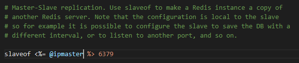
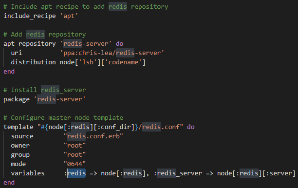
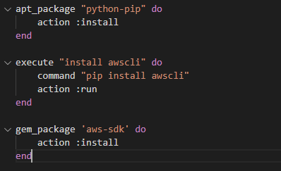
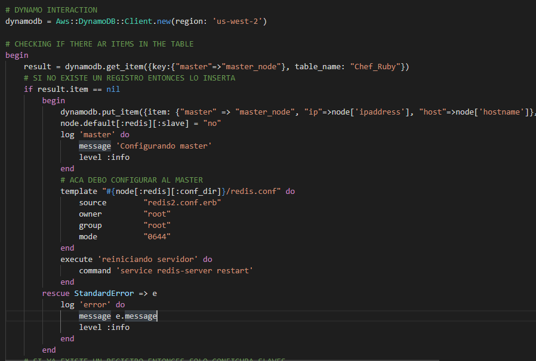
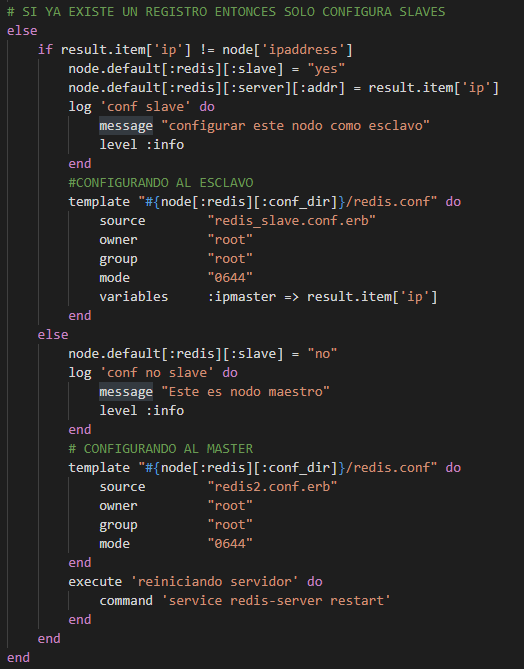
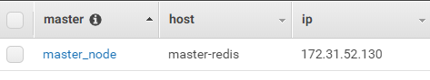

# Chef Exercise
* Excercise is about configuring Redis cluster in master - slave configuration using chef version 12.

## Templates
### redis2.conf Template
* This template is used to configure a master redis server, this node is the principal node which all slave nodes will connect to.
* This template is a the default config file that a redis server has

### redis_savle.conf Template
* This template is the one that will be used to configure a slave node. The template receives a parameter that describes the master node ip.

## Recipes
### default.rb
* This recipe is in charge of installing redis on every EC2 that comes up inside the layer.

### aws_cli.rb
* This recipe is in charge of installing the aws-cli in the EC2. This is because one of the recipes will use the aws-sdk to communicate with dynamodb

### slaves.rb
* This is the recipe that is in charge of configuring each node depending on a DynamoDB table that stores the master node. When there are no instances in the layer this is how the recipes work:

1. Each time a new node is added to the cluster, the slaves.rb recipe is in charge o getting information from a dynamo table.

2. If there are no items in the table, the recipe saves the information of the current node that is starting, this information includes: hostname and ip address.

3. If there is one item in the table, it is a sign there is a master node configured already, so the current node will be configured as a slave node.

## DynamoDB Table
* This dynamo table is only to help identify which node is the master node, and also store the ip address of the master node. the following picture shows the sctructure of the table:

